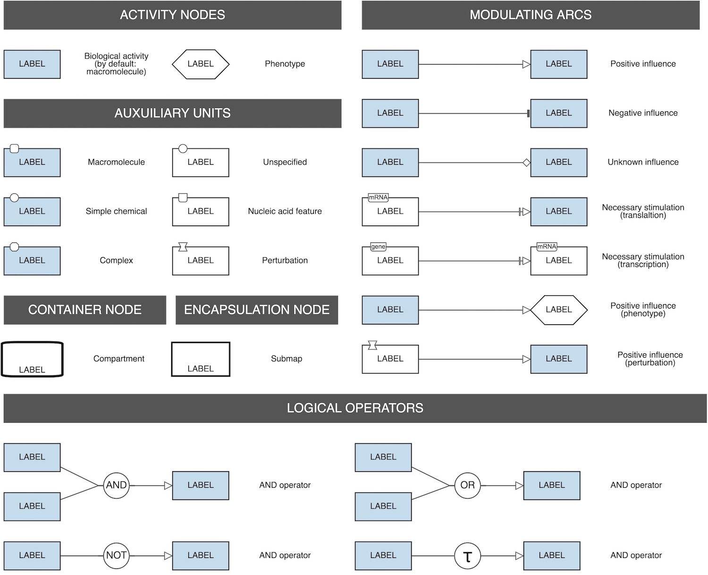

# Learner's reference cards

The learner's reference cards are designed to provide an easy entry point to the SBGN languages. In contrast to the compact [reference cards](/referencecards), the learner's cards show how the elements of the language are applied. Please note that the learner's cards do not describe all possible ways to apply the languages but can be used as a helpful reference material for learning the standard.
  
## PD Learner's Reference Card

[GraphML](images/learnerscards/pdlearnerscard.graphml) &emsp;
[PDF](images/learnerscards/pdlearnerscard.pdf) &emsp;
[SBGN 0.2 Plain](images/learnerscards/pdlearnerscard02plain.sbgn) &emsp;
[SBGN 0.3 Plain](images/learnerscards/pdlearnerscard03plain.sbgn) &emsp;
[NWT 0.3](images/learnerscards/pdlearnerscard.nwt) &emsp;
[Open in Newt](http://web.newteditor.org/?URL=http://sbgn.github.io/images/learnerscards/pdlearnerscard.nwt) &emsp;

 

## AF Learner's Reference Card

[PNG](images/learnerscards/aflearnerscard.png) &emsp;
[SBGN 0.2 Plain](images/learnerscards/aflearnerscard02plain.sbgn) &emsp;
[SBGN 0.3 Plain](images/learnerscards/aflearnerscard03plain.sbgn) &emsp;
[NWT 0.3](images/learnerscards/aflearnerscard.nwt) &emsp;
[Open in Newt](http://web.newteditor.org/?URL=http://sbgn.github.io/images/learnerscards/aflearnerscard.nwt) &emsp;

 

## ER Learner's Reference Card

The learner's reference card for the Entity Relationship language is in preparation.

 

## Acknowledgement

The SBGN learner's reference cards have been developed following the example of the [CellDesigner's notation card](http://celldesigner.org/features.html).
